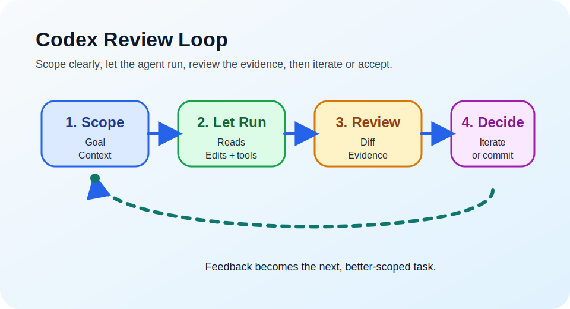

# How To Use OpenAI Codex {#use-openai-codex}

> type: category

A learning map for using the Codex app effectively, based mostly on OpenAI’s official Codex docs. The central question is how to work well with an agentic coding tool without expecting traditional IDE-style pre-approval for each edit.

## Comment: Review Happens After Edits {#review-happens-after-edits}

> type: comment

Codex edits first and asks for judgement later. Treat the app like a Git-centered review workflow, not an IDE suggestion flow that waits for approval before every change.

## Mental Model {#mental-model}

> type: category

Codex is best understood as a task agent you supervise, not as an autocomplete system you approve line by line.

### IDE Approval Loop {#ide-approval-loop}

> type: concept

> edge.contrasts: codex-review-loop

In a traditional IDE flow, you inspect suggestions before they become part of the working copy.

### Codex Review Loop {#codex-review-loop}

> type: concept

> edge.contrasts: ide-approval-loop
> edge.related: review-pane-mirrors-git

In Codex, you assign a task, let the agent work, then inspect the resulting diff and evidence before deciding what to keep.

#### Review Pane and Git {#link-to-review-pane-mirrors-git}

> type: link
> target: review-pane-mirrors-git

### You Are The Reviewer {#you-are-the-reviewer}

> type: concept

Your control point is task definition up front and review afterward. Think code review and curation, not keystroke approval.

## Working Loop {#working-loop}

> type: category

This is the practical day-to-day loop for using Codex well.

### Codex Workflow Procedure {#codex-workflow-procedure}

> type: procedure

This is the compact operational loop: define the task, let Codex work, review the evidence, then either refine or accept and feed that learning into the next task.

#### Scope A Verifiable Task {#workflow-step-scope-a-verifiable-task}

> type: step
> edge.next: workflow-step-let-codex-work
> edge.related: scope-the-task, plan-before-coding

Define the goal, context, constraints, and what done looks like before Codex starts editing.

#### Let Codex Work {#workflow-step-let-codex-work}

> type: step
> edge.next: workflow-step-review-diff-and-evidence
> edge.related: let-the-thread-run, keep-parallel-threads-separate

Let the thread read, edit, and run tools until it reaches a useful stopping point.

#### Review Diff And Evidence {#workflow-step-review-diff-and-evidence}

> type: step
> edge.next: workflow-step-iterate-or-accept
> edge.related: review-the-result, use-inline-feedback, ask-for-verification

Inspect the diff, terminal output, and checks before deciding what to keep.

#### Iterate Or Accept {#workflow-step-iterate-or-accept}

> type: step
> edge.next: workflow-step-feed-learning-into-the-next-task
> edge.related: iterate-or-commit, commit-accepts-the-curated-diff

Stay in the thread when the change needs refinement; commit when the curated result is acceptable.

#### Feed Learning Into The Next Task {#workflow-step-feed-learning-into-the-next-task}

> type: step
> edge.related: workflow-step-scope-a-verifiable-task, keep-agents-practical, agents-guides-codex

Capture the lessons in prompts, `AGENTS.md`, or workflow habits, then loop back into a better-scoped next task.

### Scope The Task {#scope-the-task}

> type: concept

Start with a task that is clear enough to verify and small enough to review.

#### Prompt Shape {#prompt-shape}

> type: concept

OpenAI recommends a prompt structure built around goal, context, constraints, and what done looks like.

#### Plan Before Coding {#plan-before-coding}

> type: concept

For ambiguous work, ask Codex to plan first or clarify missing requirements before it starts editing.

### Let The Thread Run {#let-the-thread-run}

> type: concept

A thread is the unit of work. Codex loops through reads, edits, and tool calls until the task is complete or you stop it.

#### Keep Parallel Threads Separate {#keep-parallel-threads-separate}

> type: warning

You can run multiple threads at once, but avoid having two threads modify the same files.

### Review The Result {#review-the-result}

> type: concept

Inspect both the diff and the evidence Codex provides, such as terminal logs, tests, and check results.

#### Use Inline Feedback {#use-inline-feedback}

> type: concept

Inline comments are the fastest way to steer the next turn when a change is close but not yet right.

### Iterate Or Commit {#iterate-or-commit}

> type: concept

Stay in the same thread when the task needs refinement. Commit only after the curated diff is acceptable.

## Git Review Model {#git-review-model}

> type: category

The app’s review experience is a Git workflow, not a pre-edit approval workflow.

### Review Pane Is Git {#review-pane-mirrors-git}

> type: concept

The review pane reflects the state of the repository, not only Codex edits. It can show Codex changes, your own uncommitted changes, and other repo changes.

### Stage Selects Commit {#stage-selects-the-next-commit}

> type: concept

Stage means "include this in the next commit." Use it when you want to keep part or all of the diff.

#### Stage Is Not Pre-Edit Approval {#stage-is-not-pre-edit-approval}

> type: warning

Codex does not wait for you before editing files in the app. Staging happens after the edits exist.

### Revert Discards Changes {#revert-discards-changes}

> type: concept

Revert is how you reject work you do not want to keep.

### Partial Staging Is Normal {#partial-staging-is-normal}

> type: concept

Git can hold staged and unstaged hunks in the same file. Seeing a file in both views is normal.

### Commit Is Acceptance {#commit-accepts-the-curated-diff}

> type: concept

Commit is the real acceptance boundary. Review selects the changes; commit records the accepted set.

## Work Locations {#work-locations}

> type: category

The app separates foreground work from background work so you can delegate safely.

### Local Is Foreground {#local-is-foreground}

> type: concept

Use Local when you want your usual IDE, your existing dev server, or direct hands-on inspection.

### Worktree Is Background {#worktree-is-background}

> type: concept

Use Worktree when you want Codex to run in parallel without disturbing your Local checkout.

### Handoff Moves Work Safely {#handoff-moves-work-safely}

> type: concept

Handoff moves the thread and code between Local and Worktree and handles the required Git steps safely.

### Local Environments {#local-environments-prepare-worktrees}

> type: concept

Local environments define reusable setup steps and common actions for a project.

#### Setup Scripts {#setup-scripts}

> type: concept

Setup scripts run automatically when Codex creates a new worktree, which helps install dependencies or build the project first.

#### Actions And Terminal {#actions-in-the-integrated-terminal}

> type: concept

Actions give you one-click access to common commands such as starting the app or running tests in the app’s integrated terminal.

## Durable Setup {#durable-setup}

> type: category

Codex works better when your guidance and environment are reusable instead of repeated manually in every thread.

### AGENTS Guides Codex {#agents-guides-codex}

> type: concept

`AGENTS.md` is the best place to encode repo layout, commands, conventions, constraints, and done criteria.

### Keep AGENTS Practical {#keep-agents-practical}

> type: concept

Short, accurate instructions are more useful than long vague ones. Update `AGENTS.md` when repeated mistakes show real friction.

### Configure Permissions Carefully {#configure-permissions-carefully}

> type: concept

Start with tighter sandbox and approval defaults, then loosen them only for trusted repositories or proven workflows.

### Ask For Verification {#ask-for-verification}

> type: concept

Ask Codex to run the relevant checks, confirm the result, and review the diff before you accept the work.

## Surface Choice {#surface-choice}

> type: category

Choose the Codex surface that matches the risk, speed, and level of supervision you want.

### App For Agent Supervision {#app-for-agent-supervision}

> type: concept

> edge.contrasts: cli-for-approval-gates

The desktop app is a command center for multiple agents, background work, and long-running tasks.

### CLI For Approval Gates {#cli-for-approval-gates}

> type: concept

> edge.contrasts: app-for-agent-supervision

Use the CLI when you want stronger approval control. In Read-only mode, Codex will not edit files or run commands until you approve a plan.

### IDE For Close Reading {#ide-for-close-reading}

> type: concept

Use the IDE extension when you want nearby file context and faster local exploration near the code.

### Pick By Risk And Speed {#pick-by-risk-and-speed}

> type: concept

Use the app for delegation, the CLI for tighter approval gates, and the IDE when proximity to code matters most.
